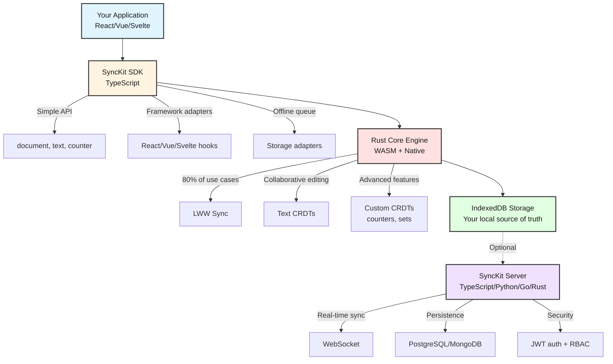

# SyncKit

<div align="center">

**True offline-first sync for modern apps—without vendor lock-in**

[](https://www.npmjs.com/package/@synckit-js/sdk)
[](https://github.com/Dancode-188/synckit/actions)
[](LICENSE)
[-brightgreen)](https://bundlephobia.com)
[](https://www.typescriptlang.org/)
[](CONTRIBUTING.md)

[Getting Started](docs/guides/getting-started.md) • [Documentation](docs/README.md) • [Examples](examples/) • [Discussions](https://github.com/Dancode-188/synckit/discussions) • [Roadmap](ROADMAP.md)

</div>

---

## 🎯 What is SyncKit?

**Build collaborative apps in hours, not months.**

SyncKit is a **production-ready sync engine** that gives you everything for local-first collaboration:
- Rich text editing with conflict resolution (Peritext + Fugue CRDTs)
- Undo/redo that syncs across tabs and sessions
- Live presence and cursor sharing
- Framework adapters for React, Vue, and Svelte

> "Add `sync.document()` to your app, get real-time sync automatically."

**The reality:** Building sync from scratch takes months. SyncKit gives you production-ready collaboration in 3 lines of code.

```typescript
const sync = new SyncKit()
await sync.init()
const doc = sync.document<Todo>('todo-123')
await doc.update({ completed: true })
// ✨ Works offline, syncs automatically, resolves conflicts
```

### 🎬 See It In Action

**1. Complex State (Kanban)**
SyncKit handles structural data like lists and nested objects with automatic conflict resolution.


**2. Collaborative Text (New in v0.2.0)**
Add Google Docs-style collaboration to your app with a single hook.

```typescript
// It's this simple:
import { useSyncText } from '@synckit-js/sdk/react'

function Editor() {
  // ✨ Automatic conflict resolution & real-time sync
  const [text, { insert, delete: del }] = useSyncText('doc-1')

  return <textarea value={text} onChange={e => insert(0, e.target.value)} />
}
```

*(Live text editing demo coming soon)*

---

## ✨ Why SyncKit?

### 🚀 **Works When Internet Doesn't**
True offline-first architecture—not just caching. Your app works perfectly on planes, trains, tunnels, and coffee shops with spotty WiFi.

### 📦 **Production-Ready, Feature-Complete**

**154KB gzipped** - Complete local-first sync solution with everything you need.

**What you get:**
- ✅ Text editing (Fugue CRDT) - Collaborative editing that just works
- ✅ Rich text formatting (Peritext) - Bold, italic, links with conflict resolution
- ✅ Undo/redo - Syncs across tabs, persists across sessions
- ✅ Real-time presence - See who's online, what they're editing
- ✅ Cursor sharing - Watch teammates type in real-time
- ✅ Counters & Sets - Distributed data structures for app state
- ✅ Framework adapters - React, Vue, Svelte (choose what you need)
- ✅ Offline-first sync - Works perfectly without internet
- ✅ IndexedDB persistence - Unlimited local storage

**Size-critical apps?** Use Lite variant (46KB gzipped, basic sync only)

**Every byte is justified.** We chose completeness over minimal size—rich text, undo/redo, cursors, and framework adapters all work together out of the box.

### 🔓 **Your Data, Your Rules**
Open source and self-hostable. No vendor lock-in, no surprise $2,000/month bills, complete data sovereignty.

### ⚡ **Fast by Design**
- <1ms local operations (~5-20μs single field update)
- <100ms sync latency (10-50ms p95)
- 154KB bundle (complete solution), 46KB lite option
- ~310KB total with React (comparable to React alone)

### 🛡️ **Data Integrity Guaranteed**
- Zero data loss with automatic conflict resolution (Last-Write-Wins)
- Formal verification with TLA+ (3 bugs found and fixed)
- 1,081+ comprehensive tests across TypeScript and Rust (unit, integration, chaos, load)

---

## 🚀 Quick Start

### Installation

```bash
npm install @synckit-js/sdk
```

### Your First Synced App

```typescript
import { SyncKit } from '@synckit-js/sdk'
import { SyncProvider, useSyncDocument } from '@synckit-js/sdk/react'

// Initialize (works offline-only, no server needed!)
const sync = new SyncKit()
await sync.init()

function App() {
  return (
    <SyncProvider synckit={sync}>
      <TodoApp />
    </SyncProvider>
  )
}

function TodoApp() {
  const [todo, { update }] = useSyncDocument<Todo>('todo-1')

  if (!todo || !todo.text) return <div>Loading...</div>

  return (
    <div>
      <input
        type="checkbox"
        checked={todo.completed}
        onChange={(e) => update({ completed: e.target.checked })}
      />
      <span>{todo.text}</span>
    </div>
  )
}
```

**That's it!** Your app now:
- ✅ Works 100% offline
- ✅ Syncs across tabs automatically
- ✅ Persists data in IndexedDB
- ✅ Resolves conflicts automatically

**Bundle:** SyncKit (154KB gzipped) + React (156KB) = **~310KB total**

**Size-critical?** `import { SyncKit } from '@synckit-js/sdk/lite'` (46KB gzipped, local-only)

**[Full tutorial (5 minutes) →](docs/guides/getting-started.md)**

---

## 🎓 Features

### Text Editing & Collaboration

- **✍️ Text CRDT (Fugue)** - Collaborative editing with conflict-free convergence
- **🎨 Rich Text (Peritext)** - Bold, italic, links with proper formatting merge
- **↩️ Undo/Redo** - Cross-tab undo that syncs everywhere
- **👥 Awareness & Presence** - See who's online and what they're editing
- **🖱️ Cursor Sharing** - Real-time cursor positions with smooth animations
- **🔢 Counters & Sets** - Distributed counters (PN-Counter) and sets (OR-Set)

### Framework Integration

- **⚛️ React Hooks** - Complete hook library for all features
- **🟢 Vue Composables** - Idiomatic Vue 3 Composition API integration
- **🔶 Svelte Stores** - Reactive Svelte 5 stores with runes support

### Core Capabilities

- **🔄 Real-Time Sync** - WebSocket-based instant sync across devices
- **📴 Offline-First** - Works perfectly with zero connectivity
- **🗄️ Local Persistence** - IndexedDB storage, unlimited capacity
- **🔀 Conflict Resolution** - Automatic Last-Write-Wins (LWW) merge for documents, CRDTs for collaboration
- **⚡ Fast Operations** - <1ms local updates, <100ms sync latency
- **📦 Production Bundle** - 154KB gzipped (complete) or 46KB (lite)
- **🔐 Secure** - JWT authentication, RBAC permissions

---

## 🏗️ Architecture



**[Detailed architecture docs →](docs/architecture/ARCHITECTURE.md)**

---

## 📚 Documentation

### Getting Started
- **[5-Minute Quick Start](docs/guides/getting-started.md)** - Build your first synced app
- **[Installation Guide](docs/guides/getting-started.md#installation)** - Setup instructions
- **[API Reference](docs/api/SDK_API.md)** - Complete API documentation

### Core Concepts
- **[Offline-First Patterns](docs/guides/offline-first.md)** - True offline architecture
- **[Conflict Resolution](docs/guides/conflict-resolution.md)** - Automatic LWW merge strategy
- **[Performance Optimization](docs/guides/performance.md)** - Bundle size, memory, sync speed
- **[Testing Guide](docs/guides/testing.md)** - Property-based tests, chaos engineering

### Migration Guides
- **[From Firebase/Firestore](docs/guides/migration-from-firebase.md)** - Escape vendor lock-in
- **[From Supabase](docs/guides/migration-from-supabase.md)** - Add offline support
- **[From Yjs/Automerge](docs/guides/migration-from-yjs.md)** - Simplify your stack

### Examples
- **[Vanilla Counter](examples/vanilla-counter/)** - Minimal example with no build tools (just open in browser!)
- **[Todo App](examples/todo-app/)** - Simple CRUD with filters
- **[Collaborative Editor](examples/collaborative-editor/)** - Real-time text editing with CodeMirror 6
- **[Project Management](examples/project-management/)** - Production-grade kanban app with drag-and-drop

**[Browse all docs →](docs/README.md)**

---

## 🎯 Use Cases

### Tier 1: Simple Object Sync (LWW)
**Perfect for:** Task apps, CRMs, project management, note apps (80% of applications)

```typescript
import { SyncKit } from '@synckit-js/sdk'
import { useSyncDocument } from '@synckit-js/sdk/react'

// Initialize once
const sync = new SyncKit()
await sync.init()

// Use anywhere
const doc = sync.document<Project>('project-123')
await doc.update({ status: 'completed' })
// Conflicts resolved automatically with Last-Write-Wins
```

### Tier 2: Collaborative Text Editing
**Perfect for:** Collaborative editors, documentation, notes

```typescript
import { useSyncText } from '@synckit-js/sdk/react'

const [text, { insert, delete: del }] = useSyncText('document-456')
await insert(0, 'Hello ')
// Character-level sync, conflict-free convergence
```

### Tier 3: Counters & Sets
**Perfect for:** Likes, votes, tags, participants

```typescript
import { useCounter, useSet } from '@synckit-js/sdk/react'

const [count, { increment, decrement }] = useCounter('likes-789')
await increment()  // Conflict-free counter

const [tags, { add, remove }] = useSet<string>('post-tags')
await add('typescript')  // Observed-remove set
```

---

## 🌐 How SyncKit Fits the Ecosystem

Different libraries make different trade-offs. Here's how SyncKit compares:

| Feature | SyncKit | Firebase | Supabase | Yjs | Automerge |
|---------|:-------:|:--------:|:--------:|:---:|:---------:|
| **Bundle Size (gzipped)** | **154KB**<br/>(46KB lite) | ~150–200KB<br/>(typical client) | ~45KB<br/>(JS client) | **65KB**<br/>(core) | 300KB+<br/>(JS/WASM) |
| **Text CRDT** | ✅ Fugue | ❌ No | ❌ No | ✅ Y.Text | ✅ Yes |
| **Rich Text** | ✅ Peritext | ❌ No | ❌ No | ⚠️ Limited | ✅ Yes |
| **Undo/Redo** | ✅ Cross-tab | ❌ No | ❌ No | ⚠️ Basic | ✅ Yes |
| **Awareness/Cursors** | ✅ Built-in | ❌ No | ❌ No | ⚠️ Extension | ❌ No |
| **Framework Adapters** | ✅ React/Vue/Svelte | ❌ No | ❌ No | ⚠️ Community | ❌ No |
| **True Offline-First** | ✅ Native | ⚠️ Limited (cache + persistence) | ❌ No native support | ✅ Full | ✅ Full |
| **Works Without Server** | ✅ Yes | ❌ No | ❌ No | ✅ Yes | ✅ Yes |
| **Self-Hosted** | ✅ Yes | ❌ No | ✅ Yes | ✅ Yes | ✅ Yes |
| **TypeScript Support** | ✅ Native | ✅ Good | ✅ Good | ⚠️ Issues | ✅ Good |
| **Production Status** | ✅ v0.2.0 | ✅ Mature | ✅ Mature | ✅ Mature | ⚠️ Stable core,<br/>evolving ecosystem |

### When to Choose SyncKit

**Choose SyncKit if:**
- ✅ You need rich text, undo/redo, cursors, and framework adapters included
- ✅ You want Vue or Svelte support (not just React)
- ✅ You value shipping fast over optimizing every byte
- ✅ You want true offline-first without vendor lock-in

**Choose alternatives if:**
- **Firebase/Supabase:** You need a full backend-as-a-service (auth, storage, functions) and offline sync isn't critical
- **Yjs:** Minimal bundle size is your #1 priority and you're okay wiring up separate plugins for undo, presence, and framework support.
- **Automerge:** You need JSON patching or unique Automerge features (and can accept 300KB+ bundle)

**[See detailed migration guides →](docs/guides/)**

---

## 📦 Packages

### Core
- **`@synckit-js/sdk`** - Core SDK (TypeScript) + WASM engine
- **`@synckit-js/sdk/react`** - React hooks and components (export from SDK)
- **`@synckit-js/sdk/vue`** - Vue 3 composables (export from SDK)
- **`@synckit-js/sdk/svelte`** - Svelte 5 stores with runes (export from SDK)
- **`@synckit-js/sdk/lite`** - Lightweight version (local-only, 46KB gzipped)

### Servers
- **`@synckit-js/server`** - Bun + Hono reference server (production-ready)

---

## 🚦 Status

**Current Version:** v0.2.0

### Production Ready ✅

The core sync engine is battle-tested and ready for production:

- ✅ **Document Sync** - LWW conflict resolution with vector clocks
- ✅ **Text CRDT (Fugue)** - Collaborative text editing with conflict-free convergence
- ✅ **Rich Text (Peritext)** - Bold, italic, links with formatting conflict resolution
- ✅ **Counters & Sets** - PN-Counter and OR-Set CRDTs
- ✅ **Offline-First Architecture** - Works perfectly without internet
- ✅ **WebSocket Protocol** - Real-time server synchronization
- ✅ **Core Rust Engine** - Memory-safe WASM with zero unsafe blocks
- ✅ **WASM Compilation** - 154KB gzipped (46KB lite), optimized performance
- ✅ **TypeScript SDK** - Document, Text, RichText, Counter, Set APIs
- ✅ **Storage Adapters** - IndexedDB and Memory storage
- ✅ **TypeScript Server** - WebSocket sync server with Bun + Hono
- ✅ **1,081+ Tests** - 87% code coverage, 100% pass rate
- ✅ **Example Applications** - Todo app, collaborative editor, project management

### Public Beta 🔶

New features we're testing with the community - stable but gathering feedback:

- 🔶 **Undo/Redo** - Cross-tab undo with persistent history
- 🔶 **Awareness & Presence** - Real-time user tracking
- 🔶 **Cursor Sharing** - Live cursor positions with animations
- 🔶 **Cross-Tab Sync** - BroadcastChannel-based synchronization
- 🔶 **React Hooks** - useSyncText, useRichText, usePresence, useOthers, useUndo
- 🔶 **Vue 3 Composables** - Composition API integration
- 🔶 **Svelte 5 Stores** - Reactive stores with runes support
- 🔶 **Quill Integration** - QuillBinding for Quill editor

### What's Next 🚧

- 🚧 **Multi-Language Servers** - Python, Go, Rust implementations
- 🚧 **Advanced Storage** - OPFS (Origin Private File System), SQLite adapter
- 🚧 **Conflict UI** - Visual conflict resolution interface
- 🚧 **Performance** - Large document optimization (>10K chars)

**[Full roadmap →](ROADMAP.md)**

---

## 🤝 Contributing

We welcome contributions from the community!

**Ways to contribute:**
- 🐛 **Bug Reports** - [Open an issue](https://github.com/Dancode-188/synckit/issues)
- 📚 **Documentation** - Improve guides, fix typos
- 🧪 **Tests** - Add test coverage
- 🌐 **Servers** - Implement Python/Go/Rust servers
- 💡 **Features** - Propose new features in discussions

**[Contributing guide →](CONTRIBUTING.md)**

---

## 🏢 Enterprise

Need enterprise support?

- 🎯 **Managed Hosting** - We host SyncKit servers for you
- 🔒 **Priority Support** - 24/7 support, SLA guarantees
- 📊 **Monitoring & Analytics** - Dashboard, alerts, insights
- 🎓 **Training & Consulting** - Onboarding, architecture review

**Contact:** [danbitengo@gmail.com](mailto:danbitengo@gmail.com)

---

## 📊 Benchmarks

### Bundle Size (gzipped)
```
SyncKit (lite):      46 KB ████████
Yjs (assembled):     65 KB ███████████
SyncKit (default):  154 KB ████████████████████████████
Firebase:           150 KB ████████████████████████████
Automerge:          300 KB ████████████████████████████████████████████████████████
```

### Sync Performance
```
Local update:       <1 ms  ████
Cross-tab sync:     <1 ms  ████
Network sync:    10-50 ms  ████████
Firebase (cold):  2-30 s   ████████████████████████████████
```

### Memory Usage (10K documents)
```
SyncKit:       3 MB  ████
Yjs:           8 MB  █████████
Automerge:   180 MB  ████████████████████████████████████████
```

**[Detailed benchmarks →](docs/guides/performance.md)**

---

## 🙏 Acknowledgments

Built with inspiration from:
- **[Yjs](https://github.com/yjs/yjs)** - Text CRDT concepts and performance optimization
- **[Automerge](https://github.com/automerge/automerge)** - CRDT theory and formal verification
- **[Linear](https://linear.app)** - Pragmatic approach to sync
- **[Figma](https://figma.com)** - Custom sync architecture patterns
- **[RxDB](https://rxdb.info/)** - Local-first database patterns

Special thanks to the local-first community for pioneering this movement.

---

## 📄 License

MIT License - see [LICENSE](LICENSE) for details.

Copyright (c) 2025 Daniel Bitengo

---

## 🔗 Links

- **[Documentation](docs/README.md)** - Complete guides and API reference
- **[GitHub](https://github.com/Dancode-188/synckit)** - Source code
- **[Issues](https://github.com/Dancode-188/synckit/issues)** - Bug reports and features
- **[Roadmap](ROADMAP.md)** - Development timeline
- **[Discussions](https://github.com/Dancode-188/synckit/discussions)** - Community discussions
- **[LinkedIn](https://www.linkedin.com/in/daniel-bitengo/)** - Connect and follow updates

---

<div align="center">

**Built with ❤️ for the local-first future**

[⭐ Star us on GitHub](https://github.com/Dancode-188/synckit) • [📖 Read the docs](docs/README.md) • [🚀 Get started](docs/guides/getting-started.md)

</div>
