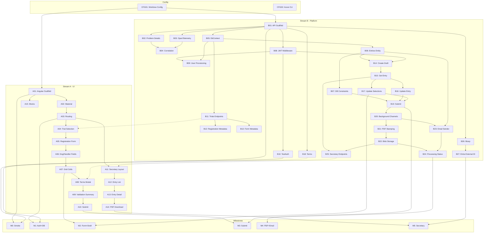

# Parallel execution plan (2-agent)

**Date:** 2026-01-21  
**Updated:** Work items fully defined

## Goal
Maximize early iteration on the on-screen registration form while the platform foundations (API/auth/DB/infra) come online in parallel.

---

## Azure Configuration

| Setting | Value |
|---------|-------|
| Subscription | `de345105-2ffc-4619-a6bc-9c41dec93241` |
| Region | `eastus` |
| Resource Group | `rg-dgmvp` |
| Naming Prefix | `dgmvp` |

---

## Port Assignments

| Stream | API Port | Web Port | Branch |
|--------|----------|----------|--------|
| Stream A (UI) | 5100 | 4200 | `feature/stream-a` |
| Stream B (Platform) | 5200 | 4201 | `feature/stream-b` |

---

## Agent Entry Points

| Agent | Entry File |
|-------|------------|
| Agent A (UI-first) | `agents/STREAM_A_ENTRY.md` |
| Agent B (Platform) | `agents/STREAM_B_ENTRY.md` |

---

## Work Item Summary

### Configuration (CFG) — Prerequisites
| ID | Name | Owner | Dependencies |
|----|------|-------|--------------|
| CFG01 | Worktree + Port Config | Both | — |
| CFG02 | Azure CLI Setup | Stream B | — |

### Stream A — UI-first (15 items)
| ID | Name | Milestone | Dependencies |
|----|------|-----------|--------------|
| A01 | Angular Scaffold | M0 | CFG01 |
| A02 | Material + Layout | M0 | A01 |
| A03 | Routing + Auth Guards | M1 | A02 |
| A04 | Trial Selection | M2 | A03, B11* |
| A05 | Registration Form | M2 | A04 |
| A06 | Dog + Handler Fields | M2 | A05 |
| A07 | Grid Cells | M2 | A06 |
| A08 | Terms Modal | M3 | A07, B18* |
| A09 | Validation Summary | M3 | A08 |
| A10 | Submit + Confirmation | M3 | A09 |
| A11 | Secretary Layout | M5 | A03, B25* |
| A12 | Entry List View | M5 | A11 |
| A13 | Entry Detail View | M5 | A12 |
| A14 | PDF Download | M5 | A13 |
| A15 | Mocks Folder (optional) | M5 | A01 |

*API dependency — can use mocks until available

### Stream B — Platform (27 items)
| ID | Name | Milestone | Dependencies |
|----|------|-----------|--------------|
| B01 | API Scaffold | M0 | CFG01 |
| B02 | Problem Details | M0 | B01 |
| B03 | OpenTelemetry | M0 | B01 |
| B04 | Correlation Headers | M0 | B02, B03 |
| B05 | DbContext Scaffold | M1 | B01 |
| B06 | Entries Entity | M1 | B05 |
| B07 | DB Constraints | M1 | B06 |
| B08 | JWT Middleware | M1 | B01 |
| B09 | User Provisioning | M1 | B08, B05 |
| B10 | TestAuth Endpoint | M1 | B08 |
| B11 | Trials Endpoints | M2 | B05 |
| B12 | Registration Metadata | M2 | B11 |
| B13 | Form Metadata | M2 | B11 |
| B14 | Create Draft | M2 | B06, B08 |
| B15 | Get Entry | M2 | B14 |
| B16 | Update Entry | M2 | B15 |
| B17 | Update Selections | M2 | B15 |
| B18 | Terms Endpoint | M3 | B01 |
| B19 | Submit Endpoint | M3 | B07, B16, B17 |
| B20 | Background Channels | M4 | B19 |
| B21 | PDF Stamping | M4 | B20 |
| B22 | Blob Storage | M4 | B21 |
| B23 | Email Sender | M4 | B20, B06 |
| B24 | Processing Status | M4 | B22, B23 |
| B25 | Secretary Endpoints | M5 | B15, B22 |
| B26 | Bicep Scaffold | M5 | B01 |
| B27 | Entra External ID | M5 | B26 |

### Milestones (6 gates)
| ID | Name | Stream A Deps | Stream B Deps |
|----|------|---------------|---------------|
| M0 | Smoke Both Apps | A01 | B01 |
| M1 | Auth + Database | A03 | B05-B10 |
| M2 | Form + Draft Save | A04-A07 | B11-B17 |
| M3 | Submit + Validation | A08-A10 | B18-B19 |
| M4 | PDF + Email | — | B20-B24 |
| M5 | Secretary Portal | A11-A14 | B25-B27 |

### Mocks (1 item)
| ID | Name | Owner | Dependencies |
|----|------|-------|--------------|
| MOCK01 | Fixtures | Stream A | A01, A05 |

---

## Dependency DAG



---

## Streams

### Stream A — UI-first (Agent A)
1) Web shell + routing + layout system (Material)
2) Trial selection UI (wired to `GET /api/trials` when available; mocked until then)
3) Registration form UI (left-half fields) + validation UX
4) Grid selection UI (upper/lower) + disabled-cell UX
5) Terms UX + gating
6) Secretary portal UI (list/detail)

**Early deliverable:** pixel-accurate(ish) form representation and Playwright driving it.

**Agent entry point:** `agents/STREAM_A_ENTRY.md`

### Stream B — Platform (Agent B)
1) API skeleton + `/api/health` + correlation header
2) TestAuth endpoint (per PRD) to unblock deterministic Playwright
3) EF Core schema + migrations + JSON-seeded trials
4) Auth policies + role enforcement + user provisioning + allowlist
5) Entry draft/create/update + selections endpoints
6) Submit + validation + terms recording
7) Background processing skeleton (Channels)
8) PDF template load + stamping + blob storage + SAS
9) Email sender + idempotency + status endpoint
10) Infra scaffold (Bicep) once local app shape stabilizes

**Early deliverable:** stable API contract endpoints so UI can stop mocking.

**Agent entry point:** `agents/STREAM_B_ENTRY.md`

---

## Integration milestones
- **M0:** both apps boot + smoke Playwright.
- **M1:** TestAuth + Trials API; UI trial selection switches from mock to live.
- **M2:** Draft save/reload end-to-end.
- **M3:** Submit end-to-end (without PDF/email completion).
- **M4:** PDF/email completion + status polling.
- **M5:** Secretary portal complete.

---

## Branch Strategy

```
main
├── feature/stream-a (Agent A worktree)
│   └── commits: A01, A02, A03, ...
├── feature/stream-b (Agent B worktree)
│   └── commits: B01, B02, B03, ...
└── integration merges at M0, M1, M2, M3, M4, M5
```

### Merge Points
| Milestone | Merge Action |
|-----------|--------------|
| M0 | Verify both branches build independently |
| M1 | First integration merge if desired |
| M2 | Recommended integration merge |
| M3 | Required integration merge |
| M4 | Stream B only (no UI changes) |
| M5 | Final merge to main |

---

## Work item hygiene
- Any PRD/contract change requires a dedicated work item.
- Keep work items small enough to finish in <1 day of agent time.
- Mark work items in-progress when starting, complete when done.
- Update artifact links in work items as evidence is generated.
